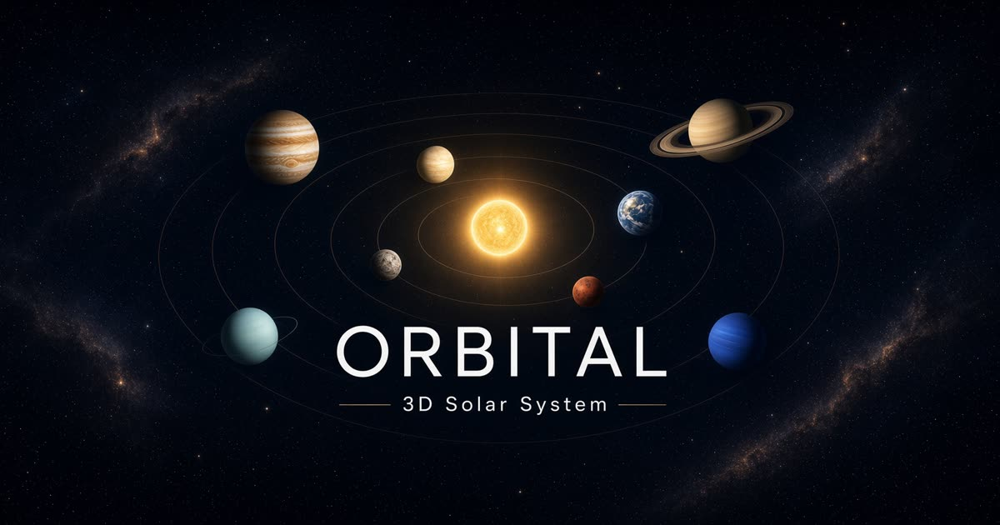

# Orrery

**Orbital** — an interactive 3D solar system explorer.

Drag to orbit, scroll to zoom, click any planet (or pick from the catalog) to focus the camera and open a fact panel. Pause, speed up, and toggle orbital trails and labels.



## Features

- Sun + Mercury through Neptune with stylized orbits and sizes
- Smooth orbital animation (delta-time based)
- Adjustable simulation speed and pause
- Orbital trails and floating labels
- Click-to-focus camera with damping orbit controls
- Per-body info panels (diameter, AU distance, period, moons, temperature)
- Dark space aesthetic with starfield
- Works on desktop and mobile viewports

## Stack

- React 19 + TypeScript
- Vite + TanStack Start / Router
- Three.js via React Three Fiber + Drei
- Tailwind CSS v4
- Zustand for simulation state

## Quick start

```bash
npm install
npm run dev
```

App runs at [http://localhost:8080](http://localhost:8080).

```bash
npm run build      # production build (Vercel/Nitro)
npm run typecheck  # TypeScript
```

## Controls

| Action | How |
| --- | --- |
| Orbit camera | Drag |
| Zoom | Scroll / pinch |
| Focus a body | Click planet or catalog chip |
| Pause / resume | Pause button or `Space` |
| Clear focus | Empty space, `Esc`, or Reset |
| Speed | Simulation speed slider |

## License

MIT
